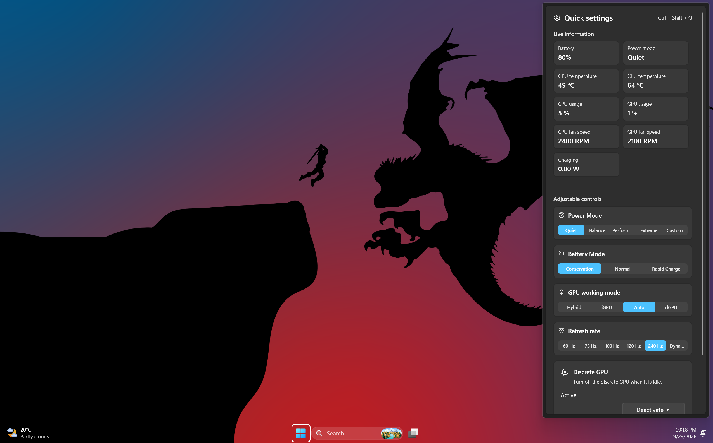
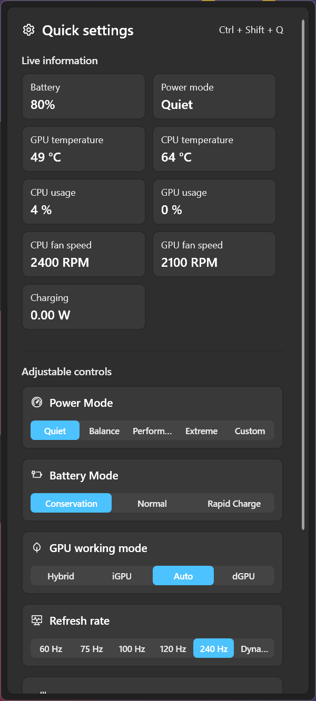
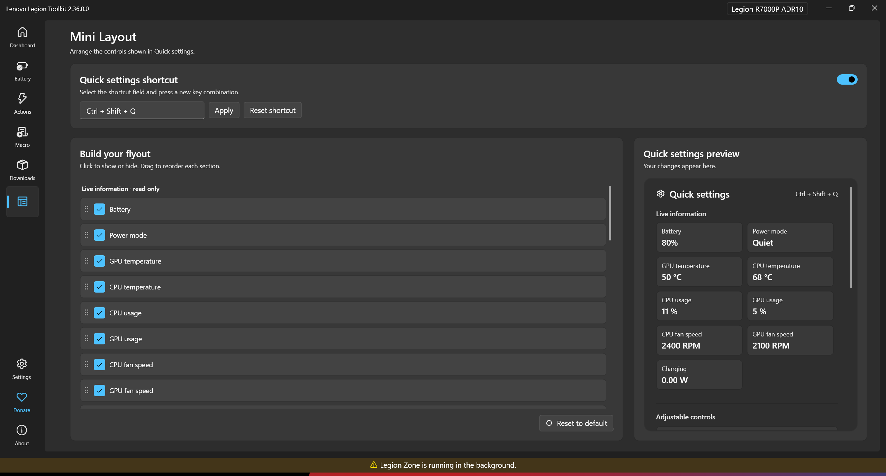

# Quick Settings for Lenovo Legion Toolkit

A Quick Settings flyout plugin for the official Lenovo Legion Toolkit (LLT), loaded through its Station extension system.

## Screenshots

<table>
  <tr>
    <td align="center"><strong>Quick Settings on the desktop</strong><br></td>
    <td align="center"><strong>Quick Settings flyout</strong><br></td>
  </tr>
  <tr>
    <td colspan="2" align="center"><strong>Mini Layout</strong><br>Configure the shortcut and reorder or hide items while previewing the flyout.<br></td>
  </tr>
</table>

## Features

- Global shortcut to toggle the flyout: **Ctrl+Shift+Q** by default, configurable in Mini Layout.
- Bottom-right flyout with live battery, temperature, usage and fan-speed tiles, where supported.
- Power mode, battery mode, refresh rate, GPU mode and supported feature switches.
- Discrete GPU dropdown with **Close GPU apps** and **Restart GPU** actions.
- **Mini Layout** page with item visibility, drag-to-reorder within each section, scrollable live preview and saved preferences.
- Custom panel icon and LLT theme integration.

## Requirements

- Windows and official LLT **2.34.0.0 or newer with the Station extension loader**.
- Hardware features depend on the laptop and the APIs exposed by LLT. Unsupported controls are hidden.
- Building requires the .NET 9 SDK, NuGet access and a compatible official LLT source checkout.

This is a community plugin, not an official Lenovo product. It runs inside LLT with the same privileges as the host.

## Install or update

1. Exit LLT from its tray menu.
2. Extract the plugin ZIP, or use `QuickSettings.dll` from your build.
3. Copy the DLL to:

   ```text
   %LOCALAPPDATA%\LenovoLegionToolkit\Plugins\QuickSettings\QuickSettings.dll
   ```

4. Start official LLT and open **Mini Layout** in navigation.
5. Press **Ctrl+Shift+Q** to open Quick Settings.

If LLT previously used the legacy `Plugin` directory, creating `Plugins` changes its plugin search root. Preserve existing plugins and move their plugin folders into `Plugins` so they remain discoverable.

For updates, replace the DLL only after exiting LLT. To uninstall, exit LLT and remove the QuickSettings plugin DLL.

## Build from source

The project references the official LLT **Lib** project and WPF-UI 2.1.0. It does not reference the host WPF assembly or require modifications to LLT.

From the repository root in PowerShell, with .NET 9 on PATH:

```powershell
$env:LLT_SOURCE = 'C:\src\LenovoLegionToolkit'
$env:DirectoryBuildPropsPath = Join-Path (Get-Location) 'BuildIsolation.props'
dotnet build .\QuickSettings\QuickSettings.csproj -c Release
```

For a portable SDK, set `DOTNET_ROOT` to its directory and prepend that directory to `PATH` before building. `LLT_SOURCE` must contain `LenovoLegionToolkit.Lib\LenovoLegionToolkit.Lib.csproj`.

Generated files are redirected into this repository's `artifacts` directory. The post-build version patcher changes the plugin's Lib assembly reference to `0.0.0.0`, following the official plugin template.

`build.ps1` also builds, creates `out\QuickSettings.zip`, and optionally installs the plugin. **Its SDK and LLT source paths currently point to the original development machine. Update those paths before using it elsewhere.** Use `-SkipInstall` for packaging only:

```powershell
.\build.ps1 -SkipInstall
```

Distribute only `QuickSettings.dll` in the ZIP. Do not bundle LLT or WPF-UI assemblies. Generated output is ignored by Git; attach the ZIP to a GitHub release separately.

## Project layout

| Path | Purpose |
| --- | --- |
| `QuickSettings/` | Plugin provider, flyout, Mini Layout and hardware controls |
| `QuickSettings/Assets/mini-layout.svg` | Embedded panel navigation icon |
| `AssemblyVersionPatcher/` | Version patcher copied from the official plugin template |
| `BuildIsolation.props` | Keeps compilation outputs outside the LLT source checkout |
| `build.ps1` | Local build, packaging and optional installation |

## Troubleshooting

- **Shortcut does not work:** close another app using the shortcut, or choose a different combination in Mini Layout.
- **Mini Layout is missing:** verify the exact DLL path and that the installed LLT includes the Station loader, then restart LLT.
- **A control or sensor is missing:** it may not be supported or available on the current hardware.
- **Plugin errors:** inspect `%LOCALAPPDATA%\LenovoLegionToolkit\log`.
- **GPU restart:** displays may flicker. Closing GPU apps can discard unsaved work; the plugin asks for confirmation.

## Verification status

The latest development build compiled successfully. Runtime behavior, hardware support, settings persistence and coexistence with other plugins should be checked on the target laptop. Compilation alone does not confirm those behaviors.

The plugin claims the `QuickSettings` capability, not the fan-control capability. It does not implement fan-curve control.

## Credits

Built on Lenovo Legion Toolkit's Station extension API and the official CustomFanCurve plugin project template. Third-party code remains subject to its upstream license terms.

## GitHub Actions builds and releases

The **Build Quick Settings** workflow runs on every push, pull request and manual dispatch. Each run builds on Windows with .NET 9.0.318 and uploads a uniquely numbered build artifact containing `QuickSettings.zip`. Artifacts expire after 14 days to limit storage; generated binaries are never committed to Git.

After pushing the repository, open **Actions → Build Quick Settings → a successful run → Artifacts** to download a build. GitHub wraps the plugin ZIP in an artifact download; extract it to get the plugin package.

Push a version tag to publish a GitHub release automatically after a successful build:

```powershell
git tag v1.0.1
git push origin v1.0.1
```

Tag releases keep `QuickSettings.zip` as a release asset. Normal pushes produce build artifacts rather than permanent releases. Build numbers identify CI packages; this workflow does not change the plugin's internal version automatically.

CI checks out a pinned official LLT API source commit by default, separately from the plugin, so builds use the plugin APIs. Set the repository Actions variable **LLT_REF** to another compatible tag or full commit SHA to change that version. The resolved commit is recorded in each run's summary. No custom secrets are needed; only the tag release job receives permission to publish releases.

Workflow action documentation: [checkout](https://github.com/actions/checkout), [setup-dotnet](https://github.com/actions/setup-dotnet), [upload-artifact](https://github.com/actions/upload-artifact).

The workflow must be pushed to GitHub before its hosted build can be verified.
